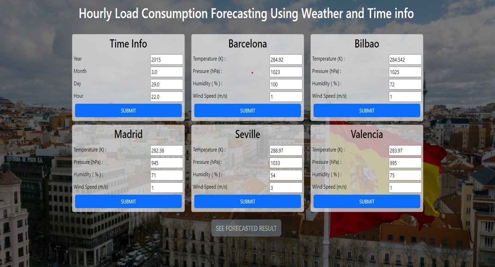
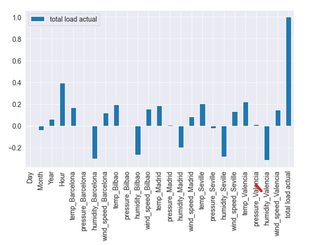
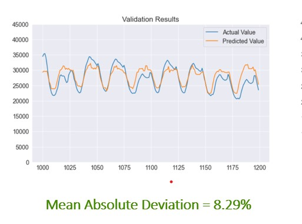
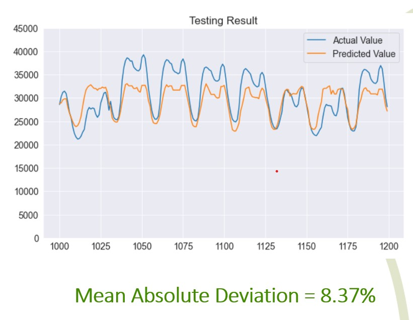

<h1 align="center">Electric Load Consumption Forecasting</h1>

## About
This is an undergrad project for `Power System Laboratory`

## Important Links
 - [Dataset](https://www.kaggle.com/datasets/nicholasjhana/energy-consumption-generation-prices-and-weathe)
 -  [Production Website to check](https://loadforecasting.vercel.app/)
 - [Report](https://github.com/alamgirakash2000/electric-load-consumption-forcasting/blob/main/EEE306_report-Group-04.pdf)
 - [Presentation Slide](https://github.com/alamgirakash2000/electric-load-consumption-forcasting/blob/main/Slide_EEE306_project.pptx)

## Abstract
Load forecasting is a critical tool for power companies to ensure that supply meets demand. It can be classified into three time horizons: short-term (a few hours), medium-term (a few weeks up to a year), and long-term (over a year).

Load forecasting is important for power companies because it helps them to make better decisions about investment and planning. For example, if a power company knows that demand is going to increase in the future, they can invest in new power plants or transmission lines. They can also make changes to their pricing structure to encourage conservation.

The different time horizons for load forecasting require different approaches. Short-term load forecasting is typically done using historical data and statistical models. Medium-term load forecasting can be done using a variety of methods, including econometric models, end-use models, and weather models. Long-term load forecasting is the most challenging, and it often requires the use of multiple models.

Our study evaluated the performance of different load forecasting approaches using historical data from a large power company. We found that the end-use and econometric approach was the most accurate for medium-term load forecasting. For short-term load forecasting, the best approach depended on the specific application.

Our findings can help power companies to improve their load forecasting accuracy and make better decisions about investment and planning. We recommend that power companies use a combination of approaches for load forecasting, and that they regularly evaluate the performance of their models.

## Some short description

### Dataset Link -->  [Datasets](https://www.kaggle.com/datasets/nicholasjhana/energy-consumption-generation-prices-and-weather)

### Determining correlation with defferent column after merging

### Result with validation dataset

### Result with testing set dataset

### Model in production

### Website Link --> [Click Here](https://loadforecasting.vercel.app/)

